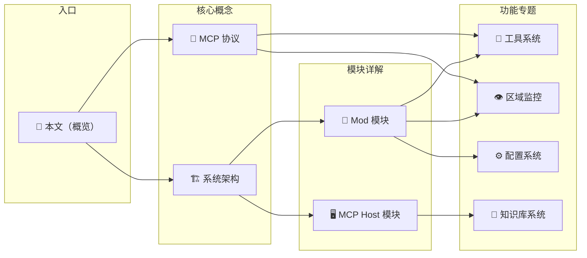

# MC-AI-Player 项目探索

> 本文档是项目的渐进式披露入口。从概览开始，根据需要通过链接深入各子模块。

## 项目概览

MC-AI-Player 是一个让 AI 代理（通过大语言模型驱动）在 Minecraft 中执行任务的系统。它由两个主要模块组成：

- **Minecraft Fabric Mod**（`src/`）— 在 Minecraft 中运行，通过 MCP 协议暴露玩家控制、世界查询、方块操作等能力
- **MCP Host**（`mcp-host/`）— 独立 Java 应用，连接 Deepseek API 与 Minecraft Mod，提供 REPL 交互

两者通过 **MCP（Model Context Protocol）** 通信，支持两种传输方式：**SSE**（默认，HTTP 长连接）和 **stdio**（子进程管道）。

## 探索路径

### 📖 核心概念

| 文档 | 内容 |
|------|------|
| [系统架构](02-architecture.md) | 整体架构、模块划分、数据流、关键设计决策 |
| [MCP 协议](03-mcp-protocol.md) | JSON-RPC 消息格式、初始化流程、传输层（SSE vs stdio） |

### 🧱 模块详解

| 文档 | 内容 |
|------|------|
| [Mod 模块](04-mod-module.md) | Fabric Mod 生命周期、客户端初始化、Mixin、执行器框架 |
| [MCP Host 模块](05-mcp-host-module.md) | Host 应用结构、REPL、LLM 桥接、工具调用循环 |

### 🔧 功能专题

| 文档 | 内容 |
|------|------|
| [工具系统](06-tools.md) | 所有 MCP 工具定义、参数、对应的执行器实现 |
| [区域监控](07-monitoring.md) | scan_region / monitor_region 的实现细节 |
| [配置系统](08-configuration.md) | Mod 配置和 Host 配置 |
| [知识库系统](09-knowledge-system.md) | 跨对话经验学习的 KnowledgeStore |

## 快速定位

- **Mod 主类**: `src/main/java/.../Mc_ai_player.java` — 模组初始化入口
- **客户端主类**: `src/client/java/.../Mc_ai_playerClient.java` — 创建执行器、启动 MCP Server
- **协议处理器**: `src/client/java/.../mcp/McpProtocolHandler.java` — JSON-RPC 路由 & 工具定义
- **Host 入口**: `mcp-host/src/main/java/.../McpHostApplication.java` — 解析参数、连接 MCP Server
- **LLM 桥接**: `mcp-host/src/main/java/.../llm/LLMBridge.java` — Deepseek API 调用 & 工具循环
- **REPL**: `mcp-host/src/main/java/.../cli/Repl.java` — 用户交互界面
